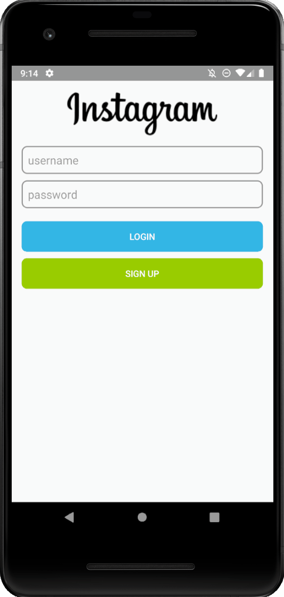

# Project 3 - *Parstagram*

**Parstagram** is a photo sharing app similar to Instagram but using Parse as its backend.

Time spent: **6** hours spent in total

## User Stories

The following **required** functionality is completed:

- [x] User can sign up to create a new account using Parse authentication.
- [x] User can log in and log out of his or her account.
- [x] The current signed in user is persisted across app restarts.
- [x] User can take a photo, add a caption, and post it to "Instagram".

The following **optional** features are implemented:

- [x] User sees app icon in home screen and styled bottom navigation view
- [ ] Style the feed to look like the real Instagram feed.
- [x] After the user submits a new post, show an indeterminate progress bar while the post is being uploaded to Parse.

The following **additional** features are implemented:

- [x] Added a placeholder image for when the user has yet to take a picture
- [x] Setup a toolbar as the action bar for displaying instagram logo
- [x] Improved layout of image and caption while posting

## Video Walkthrough

Here's a walkthrough of implemented user stories:

GIF created with [ScreenToGif](https://www.screentogif.com/).

## Notes

Describe any challenges encountered while building the app.

This part went relatively smoothly for me. The only difficulty I ran into was actually seeing the intermediate progress bar, as I believe the emulator is too fast for you
to actually notice it. I tried playing with the emulator network speeds, but to no avail. Also, I did not bother with styling the main activity, as it will be updated in
the next part.

## Open-source libraries used

Parse

## License

    Copyright [2021] [Matt Dembiczak]

    Licensed under the Apache License, Version 2.0 (the "License");
    you may not use this file except in compliance with the License.
    You may obtain a copy of the License at

        http://www.apache.org/licenses/LICENSE-2.0

    Unless required by applicable law or agreed to in writing, software
    distributed under the License is distributed on an "AS IS" BASIS,
    WITHOUT WARRANTIES OR CONDITIONS OF ANY KIND, either express or implied.
    See the License for the specific language governing permissions and
    limitations under the License.
